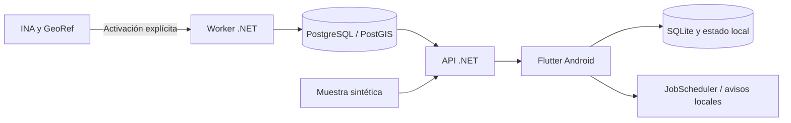

# Arquitectura

## Flujo

La API selecciona un modo: demo o datos aprobados. El teléfono consulta la API propia; el mapa opcional accede al proveedor de tiles configurado.

## Componentes implementados

| Componente | Tecnología y responsabilidad |
|---|---|
| API / worker | ASP.NET Core y Worker Service .NET 10; procesos separados |
| Core / Application | Reglas determinísticas y puertos |
| Infrastructure | HTTP de proveedores, normalización, persistencia e ingesta |
| Base | PostgreSQL 17 + PostGIS 3.5; Npgsql y SQL directo; 12 migraciones |
| App | Flutter 3.29.2, Riverpod, Dio; código en `apps/mobile/lib/src` |
| Persistencia móvil | sqflite para caché/favoritos; reglas e historial de avisos locales Android |
| Gráficos / mapa | Dibujo propio; MapLibre 0.22.0 opcional |
| Operación | Docker Compose, health, logs JSON, scripts de monitor y respaldo |

No hay EF Core, Drift, FCM ni dispatcher activo en esta entrega. El motor/outbox del servidor se conserva inactivo.

## Reglas de diseño

- La ingesta guarda antes de publicar; reintentos y revisiones no duplican mediciones.
- Derechos, aprobación hidrológica y activación de publicación son controles separados.
- Los cálculos dependen de políticas por serie; ausencia de datos nunca significa cero o ausencia de alertas.
- Android controla la entrega local; no se promete puntualidad.
- Mantener una lista útil sin contratar tiles. Ampliar componentes solo con necesidad medida.

[Dominio](DOMAIN.md) · [Contrato API](docs/design/OWN-API.md) · [Decisiones](DECISIONS.md)
