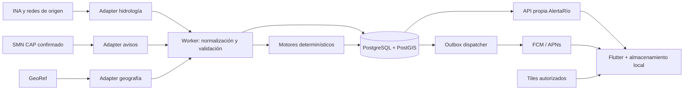
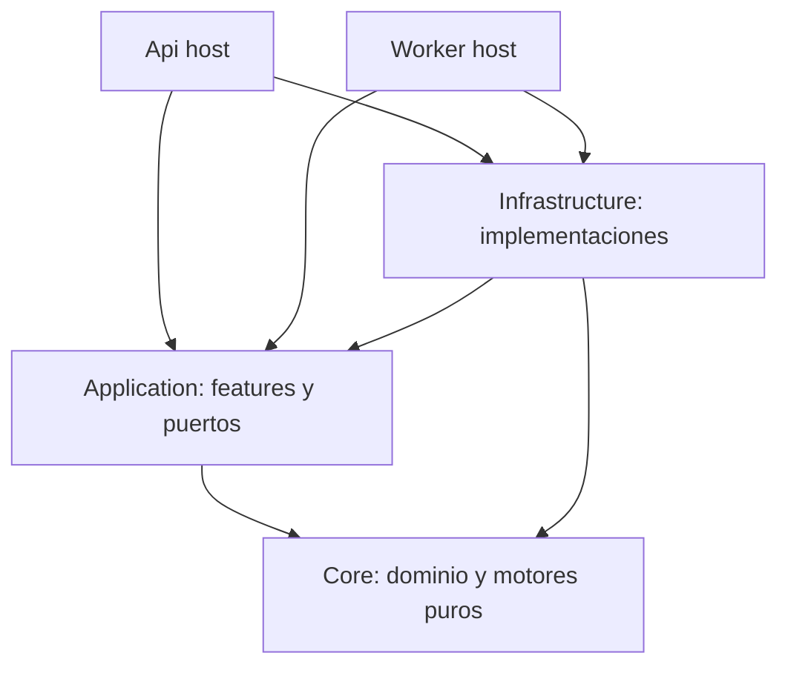

# Arquitectura propuesta

Estado: propuesta de diseño, pendiente de spikes de fase 1. Principio: monolito modular con API y worker separados como procesos, compartiendo módulos y PostgreSQL. No microservicios ni broker inicial.

## Decisiones de stack

| Área | Selección | Alternativa y criterio |
|---|---|---|
| Mobile | Flutter/Dart estable, fijado al iniciar | React Native si el equipo domina TS; nativo si se requieren capacidades muy específicas. Flutter favorece una base Android/iOS y gráficos consistentes |
| Estado | Riverpod | Bloc/Cubit también válido; elegirlo si ya hay experiencia fuerte. Riverpod encaja en consultas async, favoritos y repositorios con menos eventos ceremoniales |
| Red / modelos | Dio + json_serializable; Freezed en estados/modelos con copy/equality | Clases Dart simples para estructuras triviales; no generar capas por cada campo |
| Offline | SQLite con Drift | Preferences solo ajustes; storage seguro para credencial de instalación |
| Gráficos | fl_chart, sujeto a spike de accesibilidad y huecos | No contratar biblioteca comercial antes de medir limitaciones |
| Mapas | MapLibre + tiles OSM de proveedor a elegir | Google Maps si cobertura/coste/SDK justifican cambiar; flutter_map como fallback sencillo raster |
| Backend | ASP.NET Core **10 LTS**, EF Core de misma generación | Política oficial consultada indica soporte .NET 10 hasta noviembre 2028; fijar último parche estable al implementar |
| API | Minimal APIs agrupadas por feature | Controllers si convenciones del equipo/MVC lo ameritan; ninguno mejora por sí solo el dominio |
| Persistencia | PostgreSQL + PostGIS | Fijar versión compatible con hosting, Npgsql y PostGIS mediante prueba; no usar “latest” en producción |
| Jobs | .NET BackgroundService en host worker | Scheduler externo solo para necesidades operativas posteriores |
| Cache | Memoria limitada | Redis cuando un requisito medido lo necesite |
| Push | FCM; APNs para iOS a través de integración FCM | OneSignal reduce tareas de campañas, agrega tercero/coste; APNs directo duplica adapters |

Fuentes técnicas: [.NET soporte](https://dotnet.microsoft.com/en-us/platform/support/policy), [Minimal APIs / Controllers](https://learn.microsoft.com/en-us/aspnet/core/fundamentals/apis?view=aspnetcore-10.0), [Flutter arquitectura](https://docs.flutter.dev/app-architecture/recommendations), [Riverpod](https://riverpod.dev/), [Bloc](https://bloclibrary.dev/), [Dio](https://pub.dev/packages/dio), [Drift](https://drift.simonbinder.eu/), [fl_chart](https://pub.dev/packages/fl_chart). Estas fuentes respaldan capacidades; la selección es criterio del proyecto.

## Backend sin capas innecesarias

Cinco proyectos de producción: `Api`, `Worker`, `Core`, `Application`, `Infrastructure`. Core contiene modelos y motores puros. Application organiza casos de uso por feature y define puertos. Infrastructure implementa HTTP, EF y push. Los hosts resuelven DI/configuración. No añadir un proyecto por entidad o proveedor.

Las features agrupan petición, validación, handler y respuesta. Separación lógica de comandos y consultas cuando ayuda, **sin CQRS con dos bases ni bus**. Llamadas directas a handlers por DI. No incorporar MediatR: el problema no exige dispatch dinámico; además revisar la [licencia de la versión vigente](https://github.com/LuckyPennySoftware/MediatR) si se reconsidera. FluentValidation puede validar reglas complejas de NotificationRule mediante llamada explícita async; para filtros simples, validación nativa. Su [documentación](https://docs.fluentvalidation.net/en/latest/aspnet.html) distingue validación manual de integración automática. No combinar pipelines duplicados.

EF Core sirve para persistencia, consultas y migraciones. No envolverlo en un repositorio CRUD genérico ni otra unidad de trabajo. Application puede definir lectores/escritores específicos del caso de uso; Infrastructure hace proyecciones eficientes. Transacciones explícitas para observación+checkpoint+outbox. SQL focalizado es aceptable en consultas espaciales complejas, parametrizado y probado.

## Contexto y contenedores



Los tiles son una excepción explícita de contenido cartográfico: no exponen schemas hidrológicos al móvil. Registrar su coste, atribución y privacidad. GeoRef sigue detrás del backend.



Las flechas anteriores significan dependencia de código, no flujo HTTP. Core no conoce EF, Flutter, FCM ni INA. Un cambio de envelope INA afecta adapter y fixtures; cambiar una semántica de unidad/datum puede requerir nueva decisión y migración, no prometer aislamiento imposible de todo cambio conceptual.

## PostgreSQL, TimescaleDB y escala

PostGIS aporta índices y consultas de distancia/cobertura: [ST_DWithin](https://postgis.net/docs/ST_DWithin.html) soporta geografía en metros. Distancia mínima no determina influencia hidrológica; se requiere relación curada localidad/estación y tipo de curso.

PostgreSQL convencional alcanza para el piloto. Hipótesis de capacidad: 200 estaciones × 2 series × 96 observaciones/día = 38.400 filas/día, aproximadamente 14 millones/año. A 250–500 bytes por fila con índices, presupuesto inicial 3,5–7 GB/año, **estimación a medir**, más revisiones, WAL y backups. El piloto 30×2 da ~2,1 millones/año bajo ese supuesto; fuentes diarias generan mucho menos.

Comenzar tabla indexada por `(series_id, observed_start_at DESC)`, clave única natural y snapshot latest. Introducir particiones mensuales si retención, vacuum o plan de consultas lo exige; PostgreSQL dispone de [particionado nativo](https://www.postgresql.org/docs/current/ddl-partitioning.html). TimescaleDB queda para evaluar compresión/aggregates/operación al crecer; no es requisito por el mero hecho de tener series temporales. Verificar licencia y disponibilidad de sus funciones en hosting antes de decidir.

Redis se agrega solo tras perfilado que pruebe cuello de lectura repetitiva, coordinación multiinstancia o rate limiting distribuido. Jobs y outbox inicialmente se coordinan con DB. Un cache distribuido no corrige datos viejos ni sustituye persistencia.

## Mobile

Feature-first con presentación y datos; dominio local solo para lógica reutilizada. Repositorios de app exponen API propia + cache SQLite. Riverpod controla carga/error/dato viejo, selección y acciones; no recalcula un estado oficial ni replica el motor hidrológico. Guardar versión del DTO y migraciones de cache. Ante incompatibilidad, descartar cache recuperable conservando favoritos.

Offline: favoritos, última ficha y gráficos previamente descargados. Mostrar “Sin conexión”, edad medida contra reloj fiable cuando exista y hora absoluta. No simular fetch exitoso, nuevas alertas ni reglas push locales con datos antiguos. Ediciones de reglas pendientes se muestran “sin sincronizar”; el backend sigue aplicando versión anterior hasta confirmar. Deep links de push abren evento por ID y actualizan, sin confiar en el texto recibido como estado actual.

## Mapas: datos, motor y proveedor son cosas distintas

| Opción | Qué aporta | Coste / dependencia | Decisión |
|---|---|---|---|
| OpenStreetMap | Datos cartográficos | Atribución y licencia; tiles no equivalen a infraestructura gratuita ilimitada | Base preferida |
| MapLibre | Renderizador y ecosistema abierto | Requiere estilo, tiles, fuentes y sprites; probar plugin Flutter | Motor preferido |
| Google Maps | SDK, cartografía y servicios integrados | Facturación por productos/SKU y condiciones propias | Alternativa evaluada, no seleccionada |

La [política OSM](https://operations.osmfoundation.org/policies/tiles/) prohíbe descarga masiva/prefetch del servidor comunitario y no garantiza servicio. No usarlo como backend de producción garantizado ni ofrecer mapas offline sobre él. Elegir proveedor OSM con términos compatibles o tiles propios posteriormente. [MapLibre Flutter](https://maplibre.org/news/2026-09-02-maplibre-newsletter-august-2026/) documenta plugin y clustering; validar en Android/iOS reales. Consultar [precios Google](https://developers.google.com/maps/billing-and-pricing/pricing?authuser=2) por SKU; no asumir que todos los mapas móviles cuestan por tile.

## Monorepo y árbol objetivo

Este árbol es **diseño objetivo**. El [corte F2](docs/implementation/F2.md) ya creó la solución y los cinco proyectos backend; los demás módulos se incorporarán en su fase.

```text
AlertaRio/
  README.md, PLAN-MAESTRO.md, VISION.md, PRODUCT.md
  ARCHITECTURE.md, DOMAIN.md, DATA-SOURCES.md, API-INTEGRATIONS.md
  SECURITY.md, TESTING.md, DEPLOYMENT.md, ROADMAP.md
  BACKLOG.md, DECISIONS.md, GLOSSARY.md
  apps/
    mobile/
      lib/
        app/                  # bootstrap, router, temas, localización
        core/                 # red propia, clock, storage seguro, UI compartida
        features/
          locations/{data,presentation}/
          stations/{data,presentation}/
          favorites/{data,presentation}/
          history/{data,presentation}/
          map/{data,presentation}/
          alerts/{data,presentation}/
          notifications/{data,presentation}/
          settings/{data,presentation}/
          sources/{data,presentation}/
      test/{unit,widgets,fixtures}/
      integration_test/
      android/, ios/
      pubspec.yaml, pubspec.lock
  backend/
    AlertaRio.sln
    src/
      AlertaRio.Api/{Features,Composition,Middleware}/
      AlertaRio.Worker/{Jobs,Composition}/
      AlertaRio.Core/{Hydrology,Alerts,Trends,Notifications}/
      AlertaRio.Application/
        Features/{Locations,Stations,Measurements,Alerts,Subscriptions}/
        Ports/
      AlertaRio.Infrastructure/
        Providers/{Ina,Smn,GeoRef}/
        Persistence/{Configurations,Migrations}/
        Notifications/Fcm/
        Observability/
    tests/
      AlertaRio.UnitTests/
      AlertaRio.IntegrationTests/
      AlertaRio.ContractTests/
      Fixtures/{Ina,Smn,GeoRef,Synthetic}/
    global.json, Directory.Packages.props
  contracts/
    openapi/                  # contrato de API propia aprobado
  docs/
    adr/
    research/{evidence,VERIFICATION.md,COMPETITORS.md}
    design/{ENGINES.md,OWN-API.md,OPERATIONS.md}
    runbooks/                 # fallas, restauración, rotación de secretos
  infrastructure/
    docker/                   # imágenes API y worker
    compose/                  # entorno local, sin datos reales de usuarios
    environments/             # parámetros no secretos por ambiente
  scripts/                    # smoke, migración, fixtures y verificación
  .github/workflows/          # CI y despliegue por paths
```

Monorepo facilita cambiar contrato, backend y mobile juntos con revisión. Versionado independiente de imagen/API/app; una release mobile no exige actualizar proveedor. No compartir clases EF ni modelos gubernamentales mediante generación Dart. Compartir únicamente contrato público propio.
