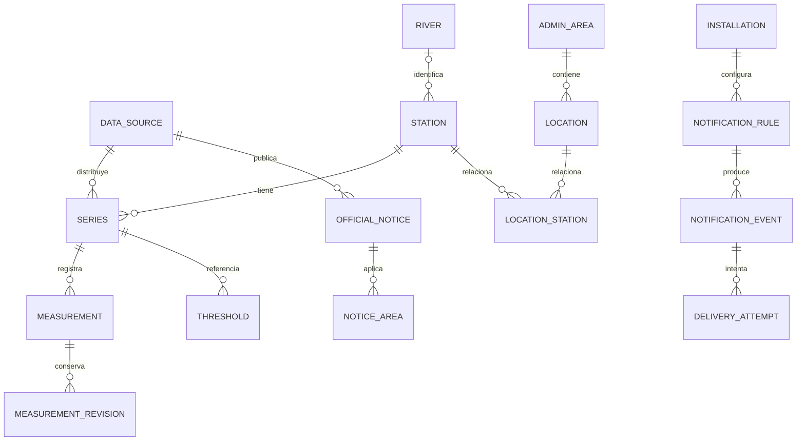

# Dominio y modelo de datos

Modelo lógico propuesto. No hay migraciones implementadas. Las tablas y campos de este documento pertenecen a AlertaRío, salvo referencias externas explícitas en [DATA-SOURCES](DATA-SOURCES.md).

## Entidades y simplificaciones

| Concepto | Responsabilidad y relaciones |
|---|---|
| DataSource | Organismo distribuidor, propietario original, licencia/permiso, URL, contacto, estado de aprobación |
| HydrologicalStation | Punto de observación físico y referencias externas; río opcional; vigencia de ubicación/escala |
| MeasurementSeries | Identidad fundamental: estación, proveedor, variable, unidad, procedimiento, soporte temporal, datum y tipo observado/simulado |
| StationMeasurement | Valor o ausencia explícita, intervalo de observación, revisión y calidad; pertenece a una serie |
| River | Catálogo interno mínimo de curso, alias y referencias; no inferirlo desde proximidad |
| Basin | Fuera de MVP como entidad operativa; campo de referencia opcional. Topología/polígonos requieren estudio futuro |
| Location | Localidad con ID y categoría GeoRef, centroide y referencia administrativa; no es domicilio del usuario |
| AdministrativeArea | Provincia, departamento y gobierno local tipados, con referencias de pertenencia; evita tres entidades de negocio vacías |
| LocationStationAssociation | Asociación curada y versionada, con justificación/autor; relación N:M |
| OfficialThreshold | Referencia publicada por una autoridad para una estación/serie/datum; valor, tipo, vigencia y evidencia |
| OfficialNotice | Aviso emitido con emisor y ciclo de vida; WeatherAlert es su categoría meteorológica, no entidad duplicada |
| Installation | Identidad seudónima de instalación para gestionar reglas y push sin cuenta personal |
| Favorite | Local en el celular, tipo estación o localidad e ID; no tablas de usuario/favoritos en servidor MVP |
| NotificationRule | Regla por instalación y objetivo, versión, ventana, condiciones, consentimiento y estado |
| NotificationEvent / DeliveryAttempt | Evento lógico y sus intentos de transporte; recibo FCM no equivale a lectura |
| IngestionRun / Checkpoint | Operación técnica, cursores y frescura, separados del dato medido |

`User` no se implementa inicialmente. Cuentas futuras solo para sincronización entre dispositivos o funciones institucionales. `MeasurementType` es un código/extensible catálogo pequeño, no una jerarquía de clases por variable.

## ER lógico

Una asociación gráfica simplifica pertenencia administrativa; en DB `Location` guarda IDs independientes de provincia/departamento/gobierno local, pues no todas las jurisdicciones forman una cadena uniforme. Un aviso puede aplicar a múltiples áreas y objetivos; no tiene por qué pertenecer a una estación.

## Esquema relacional propuesto

Convenciones: IDs propios UUID salvo mediciones de gran volumen (bigint interno); tiempos `timestamptz`; códigos externos `text`; cantidades `numeric(14,5)` como propuesta a validar contra rangos; JSONB solo payload/acotados parámetros, no relaciones esenciales. IDs externos nunca se devuelven como PK móvil.

| Tabla | Campos esenciales | Claves/índices |
|---|---|---|
| data_sources | id, name, distribution_url, owner_name, license_url, permission_status, reviewed_at | unique(code) |
| rivers | id, name, aliases | nombre no único |
| stations | id, name, river_id nullable, point geography(Point,4326), active, station_epoch | GiST(point) |
| station_external_refs | station_id, source_id, network_key, external_id, external_code, public_status | unique(source_id, network_key, external_id) |
| measurement_series | id, station_id, source_id, external_id, variable, unit, procedure, support_seconds nullable, data_kind, datum_ref nullable, epoch, cadence_seconds nullable, allowed_lag_seconds nullable, approved | unique(source_id, external_id, epoch); index station+variable |
| measurements | id, series_id, observed_start_at, observed_end_at, value nullable, quality, source_updated_at nullable, ingested_at, source_record_id nullable, hash, revision | unique(series_id,start,end); index(series_id,start DESC) |
| measurement_revisions | measurement_id, revision, previous_value, previous_quality, source_updated_at, received_at, reason, payload_hash | unique(measurement_id,revision) |
| series_latest | series_id, measurement_id, calculated_at, version | PK series_id; proyección reconstruible |
| official_thresholds | id, series_id, kind, value, unit, datum_ref, valid_from, valid_to nullable, authority, evidence_url, reviewed_at, status | index(series_id,kind,valid_from); prohibir vigencias aprobadas solapadas |
| administrative_areas | id, source_id, entity_type, external_id, name, geometry nullable, version | unique(source_id,entity_type,external_id,version) |
| locations | id, source_id, external_id, category, name, point, province_ref, department_ref, local_government_ref, census_location_ref, catalog_version | unique(source_id,external_id,catalog_version); nombre normalizado+provincia |
| location_station_associations | location_id, station_id, valid_from, valid_to, status, reason, reviewed_by | unique asociación vigente; no autoaprobación por distancia |
| official_notices | id, source_id, sender, external_identifier, sent_at, effective_at nullable, onset_at nullable, expires_at, message_type, status, scope, references_json, lifecycle, headline, description, instruction, source_url, received_at | unique(source_id,sender,external_identifier); expiry/lifecycle |
| notice_areas | id, notice_id, description nullable, geometry geometry(MultiPolygon,4326) nullable, geocodes_json | GiST(geometry); FK notice |
| notice_references | notice_id, referenced_sender, referenced_identifier, referenced_sent_at | unique(notice_id,referenced_identifier); permite referencia aún ausente |
| installations | id, credential_hash, push_token_encrypted nullable, platform, locale, consent_version, last_seen_at, revoked_at | token único si asignado; sin email ni GPS |
| notification_rules | id, installation_id, target_kind, target_id, rule_type, window_seconds nullable, threshold nullable, cooldown_seconds, enabled, version, created_at | index(target_kind,target_id,enabled); ownership obligatorio |
| rule_states | rule_id, rule_version, armed, episode_id, last_evaluated_at, last_triggered_at, last_measurement_id, current_condition | PK(rule_id,rule_version) |
| notification_events | id, rule_id, rule_version, episode_id, cause_ref, category, created_at, expires_at, payload, read_at nullable, status | unique dedup_key; index instalación+created |
| outbox | event_id, state, next_attempt_at, lease_until, attempts | unique(event_id); index pendientes |
| delivery_attempts | event_id, attempt, attempted_at, provider_result, provider_message_id nullable | unique(event_id,attempt) |
| ingestion_runs | id, provider, job, started_at, finished_at, outcome, accepted_count, quarantined_count, http_status | provider+started |
| ingestion_checkpoints | provider, stream_key, cursor, last_transport_success_at, last_valid_ingestion_at, last_new_observation_at, coverage | PK(provider,stream_key) |

No imponer `value >= 0` a alturas: una escala local puede tener valores negativos válidos. Caudal negativo también requiere semántica de dirección por serie, no un rechazo universal. Decimales de almacenamiento no implican precisión física equivalente; UI usa resolución fuente.

## Invariantes

1. No comparar umbral y altura si unidad, estación, datum o época difieren o están sin validar.
2. `observed_end_at >= observed_start_at`; instantánea conserva igualdad. Intervalos se interpretan según contrato específico.
3. Cero es número válido; null significa ausencia. No usar null para transport error: son ejes diferentes.
4. Un aviso oficial requiere autoridad, identificador, origen, vigencia y ámbito verificables. Un umbral es metadato, no aviso.
5. Estación inactiva conserva historia. Cambio de cero/ubicación crea nueva época; no unir series sin transformación autorizada.
6. Duplicado idéntico no genera revisión ni evento. Cambio de valor crea revisión; ordenar por versión fuente cuando disponible. Ante empate contradictorio, cuarentena, no “último recibido gana” automático.
7. Solo series autorizadas/públicas alimentan API pública. La accesibilidad técnica no decide publicación.
8. Nombres compartidos no implican mismo objeto. Dos estaciones cercanas pueden observar otro brazo/río o datum.
9. Datos observados y simulados no se mezclan en latest, tendencias ni reglas MVP.

## Geoespacial MVP

Búsqueda por nombre normalizado y provincia, conservando nombre oficial. Ofrecer coincidencias por categoría; preferir localidad simple/censal para selector ciudadano sin destruir entidades originales. Estaciones candidatas dentro de radios configurados (propuesta 25 km y expansión explícita a 100 km) usando PostGIS; filtrar series hidrológicas aprobadas. Mostrar distancia y río; si no hay asociación curada, decir “Estaciones cercanas: pueden no representar tu localidad”. Nunca asignar riesgo de vivienda por un radio o centroide.

## Retención propuesta

Observaciones normalizadas: 2 años online iniciales, sujeto a permiso y volumen; catálogo/umbrales versionados; datos brutos 30 días más muestras de incidentes controladas; avisos oficiales e historial técnico 1 año si licencia permite; eventos de usuario 90 días; logs 30 días. Revisar antes de producción y medir tamaño real. No eliminar una revisión necesaria para explicar un evento mientras ese evento se conserve. Archivar antes de purgar si hay necesidad probada, no acumular indefinidamente por defecto.
