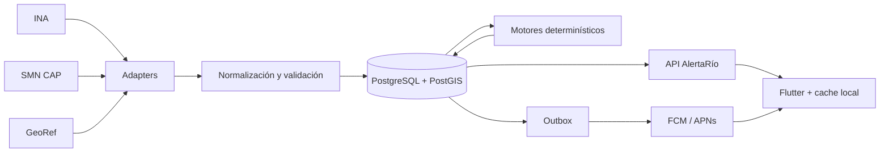
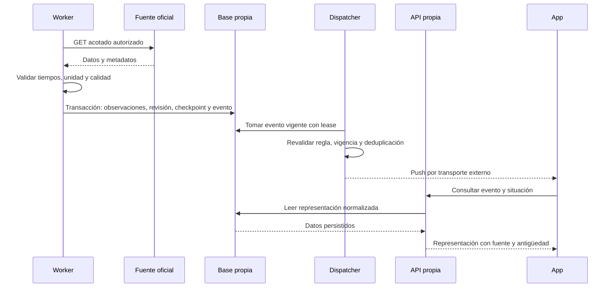

# PLAN MAESTRO DE DESARROLLO — ALERTARÍO

**AlertaRío Argentina · Diseño inicial v1 · Cierre documental: 30 de septiembre de 2026.**

**Seguimiento posterior:** [F1 inició el 1 de octubre de 2026](docs/research/f1/README.md). Se documentaron licencia/cuotas GeoRef y un inventario candidato; permisos INA/SMN, feed SMN y observación de 14 días siguen abiertos. El resto de este plan conserva su fecha de cierre y describe el estado inicial.

**Evaluación F1, 2 de octubre de 2026:** [acta NO-GO](docs/research/f1/CLOSURE.md). Terminó la investigación exploratoria, pero F1 no está aceptada y sus gates siguen abiertos. El backend sintético de F2 es material de revisión, no evidencia de aceptación de F1 o F2 ni habilitación para publicar fuentes oficiales.

Investigación y consultas externas realizadas el **29 de septiembre de 2026**. Las capturas son evidencia histórica, no información vigente para tomar decisiones sobre un río. Esta sección conserva el estado de planificación inicial; el [corte técnico F2](docs/implementation/F2.md) registra el software construido posteriormente. Las decisiones técnicas son recomendaciones sujetas a los gates indicados.

Este documento reúne el plan general. Los documentos enlazados desarrollan las especificaciones ejecutables por etapas y forman parte del entregable.

## 1. Resumen ejecutivo

AlertaRío debe convertir datos oficiales dispersos en una consulta ciudadana simple: localidad, estación, nivel, cambio, antigüedad y avisos emitidos. Se recomienda empezar con un piloto pequeño de estaciones verificadas de la Cuenca del Plata, manteniendo búsqueda de localidades argentinas sin prometer cobertura hidrológica nacional uniforme.

Arquitectura recomendada: Flutter con Riverpod; ASP.NET Core 10 LTS; PostgreSQL con PostGIS; API y worker del mismo backend modular. Ingesta periódica, normalización y persistencia antes de servir al móvil. No se necesitan inicialmente microservicios, Redis, TimescaleDB, IA ni cuentas ciudadanas.

La investigación comprobó respuestas reales de INA y GeoRef y un XML CAP oficial del SMN. Quedan pendientes permisos por dataset, validación de umbrales y un feed SMN estable y completo para automatizar avisos. Estos pendientes limitan la publicación, no impiden preparar y probar componentes independientes con datos sintéticos.

## 2. Problema

Los datos difieren en formato, unidad, escala vertical, frecuencia y cobertura. Una medición recién descargada puede tener muchas horas de antigüedad. Una estación cercana puede corresponder a otro curso de agua. Un umbral oficial puede existir sin que se haya emitido una alerta.

La aplicación debe hacer visibles esas diferencias. Su valor no consiste en presentar todos los datos como actuales, sino en permitir interpretarlos correctamente y reconocer cuándo no alcanzan para responder.

## 3. Usuarios

Primarios: residentes ribereños y personas que siguen localidades donde viven familiares o tienen propiedades. Secundarios: campings, clubes, productores y pequeños operadores que necesitan consultar información. Municipios y Defensa Civil constituyen una posibilidad futura, con necesidades y responsabilidades diferentes.

El MVP funciona sin cuenta, sin GPS obligatorio y sin conocimientos hidrológicos. No es un sistema de comando de emergencias ni una herramienta para estimar seguridad de una vivienda. Desarrollo en [VISION](VISION.md).

## 4. Propuesta de valor

Consulta por localidad, estación explícita, variaciones comprensibles, fuentes verificables y antigüedad visible. Separación permanente entre:

1. Observaciones oficiales.
2. Avisos emitidos oficialmente.
3. Cálculos propios de AlertaRío.
4. Pronósticos o estimaciones, cuando se incorporen.

Una referencia oficial superada se presenta como comparación calculada. Nunca se convierte por sí sola en una alerta emitida ni en una orden de evacuación.

## 5. Investigación de APIs

| Fuente | Verificación realizada | Uso propuesto | Pendiente relevante |
|---|---|---|---|
| INA A5 | OpenAPI leído; estaciones, series y observaciones respondieron HTTP 200 sin credenciales en las consultas ejecutadas | Hidrología principal del piloto | Permisos por red, cuotas, datum, cadencia y vigencia de umbrales |
| GeoRef | Contrato oficial leído; búsqueda Concordia sobre `/api/v2.0` respondió 200 | Localidades, IDs y centroides | Licencia por dataset, importación completa y geometrías |
| SMN CAP | Índice oficial HTML y un XML CAP 1.2 respondieron 200 | Avisos meteorológicos oficiales | Feed machine-readable estable, completo y autorizado; ciclo SAT/ACP |
| SMN WRF | Documentación del dataset gestionado por SMN en AWS | Pronóstico futuro | No se descargaron ni verificaron objetos S3 |
| PNA, SNIH, Santa Fe y SINAGIR | Portales y documentación localizados | Procedencia PNA vía INA; integraciones adicionales futuras | APIs operativas y permisos específicos sin validar |

Hallazgos concretos: INA devuelve `rows` donde el contrato de series describe un array; existen nulos y texto `"null"`; observaciones con unidad nula pueden depender de la unidad de la serie. Se observaron fechas de catálogo sin zona y un enlace de paginación que requiere corrección controlada. No seguir URLs arbitrarias suministradas por fuentes.

Para Concordia se identificaron estación 79 y series de altura/caudal; la muestra reciente de altura contenía lecturas separadas por 24 horas. **No permite calcular variaciones reales de 1/3/6/12 horas.** Los umbrales numéricos encontrados en catálogo no se aprueban para producción sin validar su vigencia y compatibilidad de escala.

Fuentes primarias: [INA A5](https://alerta.ina.gob.ar/a5/apiUI), [referencia GeoRef v2](https://www.argentina.gob.ar/georef/referencia-completa-de-la-api-georef-v-2), [registro OMM para SMN](https://alertingauthority.wmo.int/authorities.php?recId=4) y [CAP SMN](https://ssl.smn.gob.ar/CAP/AR.php). Detalle de rutas, formatos, autenticación y límites de certeza en [DATA-SOURCES](DATA-SOURCES.md); respuestas y hashes en [VERIFICATION](docs/research/VERIFICATION.md).

## 6. Competidores

RiverApp aporta consulta internacional, mapas y herramientas para usuarios del río. FloodAlert/PegelAlarm enfatiza monitoreo de umbrales. Altura del río de Mastra ofrece contexto visual local del Delta/Río de la Plata. La app homónima de Mauricio Gomez declara datos PNA y funciones complementarias. Náutica RdP integra necesidades del navegante. El nombre “Altura de los Ríos” no pudo asociarse inequívocamente a una app específica.

La comparación se basa en sitios y fichas de desarrolladores; no se instalaron aplicaciones. No se afirma que carezcan de funciones no documentadas. Diferenciación propuesta: comprensión ciudadana argentina, procedencia, suficiencia temporal y distinción de avisos frente a cálculos. Matriz de funcionalidades, cobertura, negocio, fortalezas y límites en [COMPETITORS](docs/research/COMPETITORS.md).

## 7. Funcionalidades MVP

MUST: búsqueda de localidad, selección explícita de estación, favoritos locales, altura y caudal disponible, gráfico reciente, cinco ventanas de variación con insuficiencia cuando corresponda, tendencia con ventana, umbrales verificados o ausencia explicada, avisos meteorológicos zonales oficiales, notificaciones configurables, fuente/fecha y offline parcial.

SHOULD: mapa básico con filtros/clusters, ACP con feed específico verificado e históricos extendidos. COULD: widgets, exportación y sincronización entre dispositivos. El mapa y los históricos ampliados están diseñados por fases, pero no deben desplazar los requisitos de confianza.

Si el feed de avisos no se resuelve, puede existir una beta limitada con enlace al SMN y disponibilidad explícita. **No se considerará completo el MVP solicitado mientras falte ese MUST.** Alcance y aceptación en [PRODUCT](PRODUCT.md).

## 8. Funcionalidades futuras

Lluvia aguas arriba requiere cuencas y relaciones de drenaje verificadas; no basta proximidad. Predicción y riesgo requieren metodología científica, validación y comunicación de incertidumbre. Paneles municipales/B2B, API comercial y monetización se investigarán con usuarios antes de construirlos.

MVP gratuito. Posibilidades posteriores: históricos avanzados B2C, seguimiento de sitios B2B y paneles/integraciones B2G. No implementar pagos, multitenancy ni IA anticipadamente. Explicaciones simples pueden producirse con plantillas determinísticas.

## 9. Arquitectura

Monolito modular con dos procesos desplegables: API y worker. Cinco proyectos backend: Core, Application, Infrastructure, Api y Worker. Organización por feature y dependencias explícitas. Core contiene motores puros; Infrastructure concentra adapters y persistencia.

`IHydrologyProvider`, `IAlertProvider` e `IGeographicProvider` tienen responsabilidades concretas. `IWeatherProvider` se posterga hasta incorporar precipitación/pronóstico. `IPushSender` aísla transporte de decisiones de dominio.

Un cambio de JSON INA debe resolverse en adapter/fixtures; un cambio de significado o datum puede exigir revisión del dominio. No prometer aislamiento de cambios científicos mediante una interfaz. Stack y árbol detallado en [ARCHITECTURE](ARCHITECTURE.md).

## 10. Diagramas Mermaid

El móvil nunca se conecta directamente a PostgreSQL. El ER y diagrama de dependencias están en DOMAIN y ARCHITECTURE.

## 11. Modelo de dominio

La entidad clave añadida al planteo inicial es **MeasurementSeries**: una estación puede tener distintas variables, unidades, procedimientos y soportes temporales. StationMeasurement pertenece a esa serie, no a una estación indistinta.

Se conservan Station, Location, River, DataSource, OfficialThreshold, OfficialNotice, NotificationRule y NotificationEvent. Province/Department/Government se representan como referencias administrativas tipadas. Basin se posterga como entidad operativa; User no es necesario para consulta. Favorite vive localmente. Installation permite autorizar reglas sin cuenta personal.

Relación localidad/estación N:M curada, con vigencia y justificación. Un aviso puede abarcar múltiples áreas; no pertenece necesariamente a una estación. [DOMAIN](DOMAIN.md) contiene relaciones e invariantes.

## 12. Modelo de datos

PostgreSQL relacional con PostGIS para puntos y polígonos. IDs propios opacos; IDs externos textuales y calificados por fuente/red. Tiempos UTC `timestamptz`; timestamps originales preservados. Mediciones con unique por serie/intervalo y revisiones separadas; índice serie/tiempo y GiST geográfico.

Latest es una proyección reconstruible. Umbrales tienen evidencia, autoridad, unidad, datum y vigencia. Avisos conservan identidad, referencias Update/Cancel, áreas y expiración. Reglas, episodios y outbox usan constraints para deduplicación durable.

No se necesita TimescaleDB inicialmente. Ejemplo de dimensionamiento propio: 200 estaciones × 2 series × 96 muestras/día ≈14 millones de filas/año; medir tamaño real antes de particionar. No confundir ese supuesto con cadencia de INA. Esquema lógico y retenciones en [DOMAIN](DOMAIN.md).

## 13. Flujo completo de datos

Fuente → adapter → validación → normalización → cuarentena o persistencia → revisión/latest → motores → representación propia → móvil. Notificaciones salen de outbox transaccional después de persistir, no directamente del fetch.

Guardar observación, publicación/revisión fuente e ingesta como relojes separados. La UI puede decir “medido hace 16 h; consultado hace 8 min”. Un backfill no dispara pushes históricos. Cambios de datum separan épocas de serie.

## 14. Estrategia de ingestión

Elegir B, workers periódicos, para datos recientes, catálogos, avisos y geografía. Históricos mediante ingesta incremental/backfill de baja prioridad. A, consulta directa a fuente, se reserva a pruebas acotadas de integración, no al recorrido normal del usuario.

Políticas candidatas: 15 minutos para series piloto adecuadas; menos consultas para series diarias; catálogo diario; avisos cada cinco minutos solo si el proveedor lo admite; GeoRef snapshot mensual. Son decisiones propias por validar, no rate limits oficiales.

Lease/checkpoint por stream, reintentos limitados con jitter, respeto a Retry-After, circuit breaker, control de tamaño y reconciliación de correcciones. Fuente fallida no devuelve lista vacía exitosa. Frescura por cadencia C y retraso L aprobados, no un TTL universal. Detalles en [API-INTEGRATIONS](API-INTEGRATIONS.md).

## 15. API propia

Rutas propuestas `/v1/locations`, `/v1/stations`, `/v1/stations/{id}/summary`, `/v1/series/{id}/measurements`, `/v1/notices`, `/v1/sources`, instalación, reglas e historial. Son rutas internas de diseño, **no endpoints gubernamentales**.

Summary ofrece calidad/frescura independientes por variable, cinco ventanas y motivos de ausencia, umbrales y cobertura del feed. `notices:[]` no significa ausencia confirmada si cobertura no es completa. Errores ProblemDetails, cursores, límites de rango, ETag sensible a vigencia y ownership en operaciones privadas. Contrato detallado en [OWN-API](docs/design/OWN-API.md).

## 16. Flutter y experiencia de uso

Flutter estable fijado tras spike; Riverpod para estado async e inyección; Dio; serialización tipada; Freezed donde reduzca código repetitivo; Drift/SQLite para favoritos y cache. Bloc/Cubit es alternativa válida si la experiencia del equipo lo favorece. No agregar una capa de casos de uso a cada pantalla trivial.

Inicio prioriza localidad/estación, nivel, variación con ventana y antigüedad. Gráfico y umbrales debajo; caudal y métricas adicionales en detalle. Aviso oficial ocupa tarjeta independiente. Navegación: Inicio, Mapa, Avisos y Favoritos, con búsqueda y ajustes accesibles.

MapLibre es renderizador; OSM aporta datos; proveedor de tiles se elige aparte. No usar servidores comunitarios como infraestructura ilimitada ni descargar sus tiles masivamente. Lista funcional cuando fallan mapas. Textos grandes, contraste y lector de pantalla; ningún estado depende solo de color.

## 17. Backend y motores

ASP.NET Core 10 LTS, Minimal APIs agrupadas, handlers directos por DI, EF Core/PostGIS. Controllers son una alternativa organizativa, no una necesidad. CQRS solo separación lógica de lecturas/escrituras; no base duplicada ni bus. FluentValidation manual para reglas complejas, sin pipelines redundantes.

Tendencia: elegir extremos comparables por ventana, tolerancia temporal explícita, calcular Δ absoluto y clasificar con ε por serie. No interpolar v1; datos insuficientes no son “estable”. No usar porcentaje de altura, porque depende de un cero arbitrario. Outliers se marcan y revisan, no se reemplazan silenciosamente.

Estado: disponibilidad, condición calculada y avisos oficiales independientes. Notificaciones: reglas con ventana, episodios, histeresis, cooldown, deduplicación, outbox, TTL y revalidación antes de despacho. FCM aceptado no prueba lectura. Algoritmos y casos TR/NT en [ENGINES](docs/design/ENGINES.md).

## 18. Seguridad

Consulta pública y favoritos locales. Reglas remotas usan credencial opaca de instalación, distinta del token push; ownership en cada operación. Cuenta y JWT no son necesarios en MVP; OIDC/PKCE se evaluaría para sincronización futura. Administración con identidad fuerte, permisos y auditoría.

HTTPS, secretos fuera de repo/mobile, validación de JSON/XML, protección XXE/SSRF, límites de consultas, logs sin tokens/GPS y versiones fijadas. GPS opcional y sin seguimiento continuo. Borrado de instalación y retención documentada. Revisar Ley 25.326, tratamiento y transferencias internacionales con responsable competente antes de beta. [SECURITY](SECURITY.md).

## 19. Testing

Unit tests de motores, adapters con fixtures y reloj fijo; integración PostgreSQL/PostGIS real; API contract/authorization; worker crash/replay/concurrencia y notificaciones. Flutter unit/widget/integration con offline, fuentes grandes, permisos y dispositivos reales para push.

CI ordinaria sin llamadas gubernamentales. Fixtures con procedencia/hash y permiso, más sintéticas para fallos. Nunca usar EF InMemory para certificar geografía. Testing empieza en fase 1; fase 10 consolida el sistema. [TESTING](TESTING.md).

## 20. DevOps

Monorepo con `apps/mobile`, `backend/src`, `backend/tests`, `contracts`, `docs`, `infrastructure`, `scripts` y workflows. Docker para API/worker, Compose local con PostGIS y mocks, versiones fijadas y ambientes separados.

GitHub Actions: formato/análisis/tests/contratos/secrets; imágenes por commit; staging y promoción del mismo digest. Migraciones con job único, patrón expand/contract, backup/restore ensayado. iOS requiere macOS/signing y pruebas propias.

Se compararon Azure, Railway, Render, Fly.io y VPS; **ninguno seleccionado**. Cotizar API+worker+DB+backups+red+logs+tiles y operación, no solo plan de entrada. Precios dinámicos no verificados se indican pendientes; presupuestos orientativos se identifican como estimaciones propias. [DEPLOYMENT](DEPLOYMENT.md).

## 21. Observabilidad

Registrar intento, HTTP exitoso, ingesta válida y última observación nueva por separado. Permite distinguir “INA no respondió en 40 minutos” de “respondió pero no hay lecturas nuevas” o “el schema fue rechazado”.

Logs estructurados, métricas de latencia/errores/frescura/cuarentena/outbox, tracing y health checks. Una caída externa no debe retirar una API que puede servir datos viejos correctamente etiquetados. Objetivos internos propuestos: API 99,5% mensual y p95 summary <500 ms bajo carga acordada; no son SLA de INA ni garantía al ciudadano. [OPERATIONS](docs/design/OPERATIONS.md).

## 22. Riesgos

Principales: permisos inciertos, feed SMN incompleto, ausencia de SLA, datos viejos/nulos, schema drift, datum/unidades/tiempos incorrectos, estación no representativa, falsa interpretación de umbral, push retrasado y costes crecientes.

Mitigaciones: allowlist de fuentes/series, adapter probado, calidad/antigüedad explícitas, revisión hidrológica, semántica de tres ejes, outbox/TTL, límites/cotización y restore. Registro R01–R20 con dueños y puertas en [OPERATIONS](docs/design/OPERATIONS.md). No resolver incertidumbre mostrando un estado verde.

## 23. Roadmap

F0 investigación → F1 prueba de fuentes → F2 backend mínimo → F3 normalización → F4 DB/ingesta → F5 tendencias → F6 Flutter → F7 mapas → F8 notificaciones → F9 históricos ampliados → F10 pruebas integrales → F11 observabilidad completa → F12 beta → F13 producción.

Cada fase incluye objetivo, tareas, archivos, dependencias, aceptación, tests, riesgos y tamaño relativo en [ROADMAP](ROADMAP.md). Calidad y observabilidad mínima comienzan antes de sus fases de consolidación. Un gate externo pendiente no se considera cerrado por escribir mocks.

## 24. Backlog

Seis épicas de MVP, features y **22 historias** con tareas, dependencias, prioridad, aceptación Given/When/Then y pruebas. Cubren fuentes/confianza, plataforma de datos, consulta, visualización, avisos/notificaciones y operación/lanzamiento. Cola futura separada, sin implementación anticipada. [BACKLOG](BACKLOG.md).

Cada trabajo posterior debe indicar historia y fase, alcance de archivos y pruebas; actualizar documentos si cambia una decisión. Entregar cortes revisables, no toda la aplicación en una única iteración.

## 25. Criterios de aceptación generales

- Consultar y guardar favoritos sin cuenta ni GPS obligatorio.
- Identificar localidad, estación, nivel, ventana y antigüedad en menos de diez segundos en evaluación de usuarios definida.
- Toda cantidad conserva fuente, unidad y tiempo; caudal no hereda frescura de altura.
- Serie diaria no produce Δ6 h inventado; ausencia no se convierte en cero o estable.
- Cruce de umbral no produce aviso oficial ni orden de evacuación.
- Aviso cancelado/expirado no se despacha como vigente; error del feed no se presenta como ausencia de avisos.
- Replay/reintentos no duplican eventos lógicos; entrega push no se garantiza.
- Contratos, permisos, piloto, privacidad, backup y operación validados antes de producción.

Se aceptan funciones de baja cobertura cuando la ausencia es real y explícita, pero no declarar cubierto un requisito de integración que aún no existe. Matrices precisas en PRODUCT, TESTING y ENGINES.

## 26. Complejidad relativa

| Área | Complejidad | Principal incertidumbre |
|---|---|---|
| Fuentes, permisos, cadencias | Alta | Dependencias externas y semántica |
| API mínima y favoritos locales | Baja | Convenciones y alcance |
| Normalización/ingesta | Alta | Revisiones, nulos, compatibilidad y reintentos |
| Tendencias determinísticas | Media | Calibración y datos insuficientes |
| Geografía de avisos | Alta | Feed, polígonos, ámbitos y cancelaciones |
| Flutter/offline/accesibilidad | Media-alta | Plugins/dispositivos y comprensión |
| Notificaciones durables | Alta | Concurrencia, reentrega y lifecycle |
| Hosting/operación | Media | Presupuesto, backups y responsabilidad operativa |

No se fija fecha ni horas sin conocer equipo, experiencia, macOS/dispositivos y respuestas de organismos. Camino crítico: fuentes/permiso → normalización → persistencia → motores → consulta/avisos → pruebas/beta. Fase 1 permite estimar sprints con menos incertidumbre.

## 27. Orden exacto de implementación recomendado

Primero contrato y permisos de fuentes; luego contrato propio y backend mínimo; normalización; DB/ingesta; motores; Flutter básico; mapa según alcance; identidad/reglas/outbox/push; histórico ampliado; validación integral/operación; beta; producción. El [roadmap](ROADMAP.md) detalla este orden y sus dependencias. No instalar infraestructura compleja antes de comprobar que existen los datos requeridos.

### Primeros 10 pasos concretos de un desarrollador

1. Leer DATA-SOURCES, VERIFICATION y DECISIONS; abrir una lista de pendientes de US-01/02/03 y conservar la fecha de las capturas.
2. Completar ficha de licencia/permiso y atribución por red INA, GeoRef y SMN; preparar solicitudes a canales oficiales donde falte información.
3. Confirmar feed SMN machine-readable estable, alcance SAT/ACP, actualizaciones/cancelaciones y reglas de consumo. Mantener integración deshabilitada hasta cerrar el gate.
4. Seleccionar localidades y 10–30 estaciones candidatas; identificar series observadas, públicas y representativas, sin usar proximidad como única prueba.
5. Ejecutar probes acotados autorizados y registrar cadencia/retraso/nulos durante el período de validación; probar GeoJSON, paginación y correcciones.
6. Ratificar unidades/datum/épocas y umbrales; aprobar parámetros de frescura, tolerancia temporal y ruido por serie con revisión hidrológica.
7. Convertir solo muestras autorizadas en fixtures saneadas; crear fixtures sintéticas de error, cancelación, dato diario y cambio de schema.
8. Aprobar el contrato propio mínimo de summary/localidades/estaciones/avisos con estados parciales y motivos de indisponibilidad.
9. Crear la solución .NET 10, hosts API/worker, proyectos mínimos y CI de fase 2; exponer summary sintético y pruebas de contrato sin depender de organismos.
10. Implementar el primer adapter y su normalización con fixtures, comprobar aislamiento del contrato y pasar a persistencia únicamente al cumplir aceptación de fase 3.

Los pasos 2–6 tienen trabajo externo; preparar contratos/fixtures sintéticas independientes puede avanzar mientras se resuelven, sin dar por cerradas esas validaciones.

### Decisiones que todavía necesitan validación

Permisos/redistribución, feed SMN completo, zona de campos sin offset, datum y vigencia de umbrales, cadencias/ruido, estaciones piloto, paquetes Flutter/mapas, alcance inicial iOS, proveedor de tiles, hosting/región/coste, tratamiento de datos y comprensión UX. Responsable y evidencia requerida para cada decisión en [DECISIONS](DECISIONS.md).

### APIs verificadas y no verificadas

**Verificadas mediante consultas reales:** INA A5 catálogo filtrado, series y observaciones acotadas; GeoRef v2.0 búsqueda de localidades; índice HTML CAP SMN y un XML oficial enlazado. Contratos INA/GeoRef descargados. Esto no certifica todas sus rutas ni continuidad.

**No verificadas completamente:** feed automatizable completo SMN, ACP operativo, precipitaciones/radar, simulaciones INA, GeoJSON en ejecución, APIs directas PNA/SINAGIR/provinciales, descarga WRF S3, cuotas/SLA y derechos de todas las redes. Tampoco se verificaron todavía FCM/APNs o hosting con credenciales propias. Detalle y evidencia en [VERIFICATION](docs/research/VERIFICATION.md).

El proyecto queda preparado documentalmente para desarrollar por etapas. La siguiente etapa recomendada es **Fase 1: validación controlada de fuentes y selección del piloto**.
