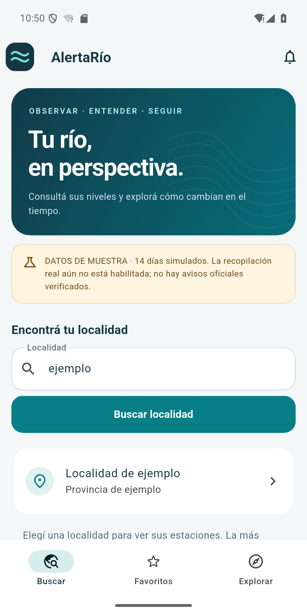
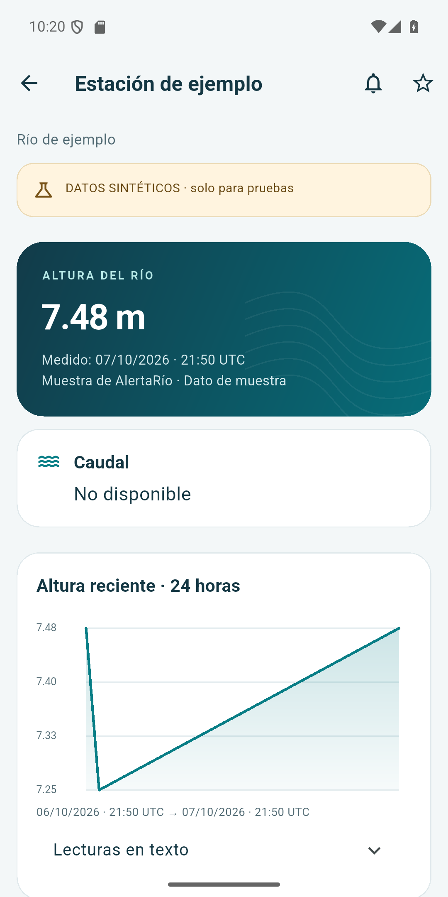
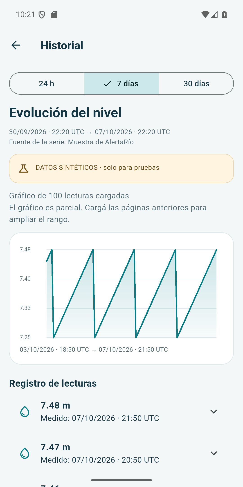

<h1 align="center">AlertaRío Argentina</h1>

**El estado de los ríos, con contexto y datos trazables.**

App Android para buscar localidades, consultar estaciones, comparar niveles y guardar favoritos. Cada lectura conserva su fuente y hora; los datos faltantes y las copias sin conexión se identifican.

**Android 8+ · Flutter · .NET 10 · PostgreSQL/PostGIS**

[Ejecutar la demo](#probar-en-android) · [Documentación](docs/README.md) · [Publicar en Google Play](docs/PLAY-STORE.md)

## Así se ve

Interfaz renovada: identidad propia, tarjetas de lectura y gráficos con escala. Capturas reales del rediseño, tomadas en Android. **La estación y los 14 días de lecturas son ficticios**, para recorrer la interfaz sin habilitar fuentes reales.

  
  
  

## Qué incluye

- Búsqueda por localidad y selección de estación.
- Altura, caudal y variaciones por ventana, cuando hay datos comparables.
- Gráfico reciente e historial paginado de hasta 30 días.
- Favoritos y última ficha disponible sin conexión.
- Exploración por zona; mapa opcional con proveedor configurable.
- Seguimiento local Android con permiso del usuario. Puede demorarse y no sustituye los canales de emergencia.

**Estado:** F1–F12 cerradas para el [alcance técnico Android](docs/implementation/TECHNICAL-CLOSURE.md). La demo funciona localmente; las fuentes reales, la beta pública y la publicación en tienda aún requieren activación. SMN se consulta mediante enlace a su sitio oficial.

## Probar en Android

Seguí la [guía breve para ejecutar y ver la app](docs/EJECUTAR.md): iniciá la API, abrí el emulador y ejecutá Flutter. La demo no necesita PostgreSQL.

Buscá **ejemplo** para recorrer la localidad, la estación y su historial. La interfaz se ve en Android; la API no sirve una página web.

## Dentro del repositorio

| Carpeta | Contenido |
|---|---|
| [apps/mobile](apps/mobile) | App Flutter y seguimiento nativo Android |
| [backend](backend) | API, worker, dominio y pruebas |
| [contracts/openapi](contracts/openapi/v1.json) | Contrato HTTP |
| [infrastructure](infrastructure) | PostgreSQL, migraciones y despliegue |
| [docs](docs/README.md) | Guías, decisiones y evidencia |

Para desarrollar: [arquitectura](ARCHITECTURE.md) · [pruebas](TESTING.md). Para operar: [despliegue](DEPLOYMENT.md) · [fuentes](DATA-SOURCES.md).
